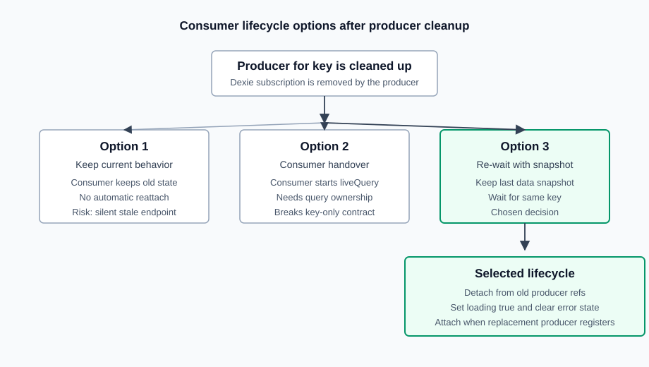

# 0001: Consumer Lifecycle After Producer Cleanup

## Status

Accepted: consumer re-waiting with snapshot.

## Context

`useLiveQuery` owns the real Dexie `liveQuery` subscription for a key.
`useLiveQuerySubscription(key)` consumes shared reactive state by key and does
not receive a query function.

When a producer component is destroyed, the producer unsubscribes from Dexie and
is removed from the subscription map. Consumers can outlive that producer, for
example when a layout-level consumer observes state produced by a page-level
component.

The lifecycle behavior for those long-lived consumers must be explicit because
it affects ownership, stale data, loading state, and future reattachment.

A mounted consumer represents an active UI scope that still needs the shared
state. Producer cleanup only means that live-query ownership is temporarily
missing; it does not mean the consumer UI no longer needs its last known data.

## Decision

Active consumers will return to a waiting state for the same key when their
producer is cleaned up.

They keep a snapshot of the last `data` value, set `loading` to `true`, set
`hasError` to `false`, clear development-only `error` to `undefined`, and wait
for a replacement producer with the same key. When a new producer registers that
key, waiting consumers attach synchronously to the new shared state and receive
updates again.

Consumers remain pure consumers. They never create Dexie `liveQuery`
subscriptions, and `useLiveQuerySubscription(key)` remains key-only.

Manually stopped consumers are not reactivated automatically. A stopped consumer
reattaches only when its own `restart()` control is called.

When a consumer scope is disposed, its local snapshot is released with the
composable state. Applications that keep returned state references outside the
consumer scope own that longer lifetime explicitly.

## Options Considered

| Topic                           | Option 1: Keep Current Behavior                                                 | Option 2: Consumer Handover                                                          | Option 3: Re-Waiting With Snapshot                                                                    |
| ------------------------------- | ------------------------------------------------------------------------------- | ------------------------------------------------------------------------------------ | ----------------------------------------------------------------------------------------------------- |
| Behavior after producer cleanup | Consumer stays attached to old producer state or a local snapshot.              | Consumer creates its own Dexie `liveQuery` while no producer exists.                 | Consumer detaches, keeps the last `data` snapshot, and waits for the same key.                        |
| Consumer API                    | Remains key-only.                                                               | Must receive query knowledge, a fallback query, or another takeover mechanism.       | Remains key-only.                                                                                     |
| Producer ownership              | Preserved.                                                                      | Blurred because a consumer can become an implicit producer.                          | Preserved.                                                                                            |
| Query ownership                 | Stays with `useLiveQuery`.                                                      | Moves temporarily into the consumer path.                                            | Stays with `useLiveQuery`.                                                                            |
| Reattach behavior               | No automatic reattach when a replacement producer registers.                    | Replacement producer must coordinate with a temporary consumer-owned subscription.   | Waiting consumer attaches synchronously when a replacement producer registers.                        |
| Stale data risk                 | High for long-lived consumers because they can reach a silent stale endpoint.   | Lower while takeover works, but ownership mistakes become harder to reason about.    | Lower because a replacement producer reactivates existing consumers.                                  |
| Loading and error semantics     | No clear signal that the producer is gone.                                      | Consumer has to distinguish producer absence from its own live-query lifecycle.      | Producer absence is represented as waiting: snapshot data, `loading = true`, and cleared error state. |
| Implementation complexity       | Lowest.                                                                         | Highest; requires takeover ownership, query transfer, and handback behavior.         | Moderate; requires active consumer tracking and re-wait coordination.                                 |
| Maintainability                 | Simple code, but surprising long-lived consumer behavior.                       | Harder to explain because consumers sometimes produce.                               | More internal coordination, but the public ownership model stays explicit.                            |
| Decision                        | Rejected. It preserves simplicity at the cost of predictable key-based sharing. | Rejected. It violates the key-only consumer contract and weakens producer ownership. | Accepted. It preserves the public model while avoiding stale dead-end consumers.                      |

## Decision Diagram

## Consequences

- `useLiveQuery` remains the only API that creates Dexie `liveQuery`
  subscriptions.
- `useLiveQuerySubscription(key)` remains key-only.
- The subscription scope needs active consumer tracking in addition to waiting
  consumer tracking.
- Producer cleanup becomes a coordination event for consumers that are currently
  attached to that producer.
- The waiting state after producer cleanup is not an error state. It represents
  missing producer ownership for an otherwise valid key.
- Runtime implementation is separate from this ADR and should be handled in a
  dedicated implementation change.
