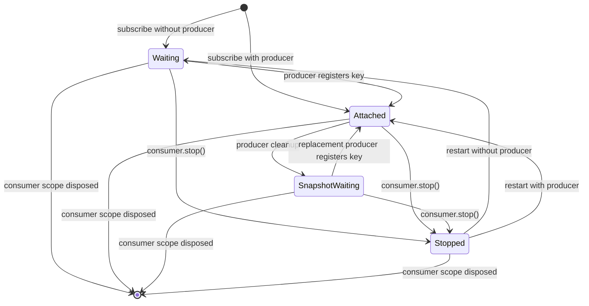
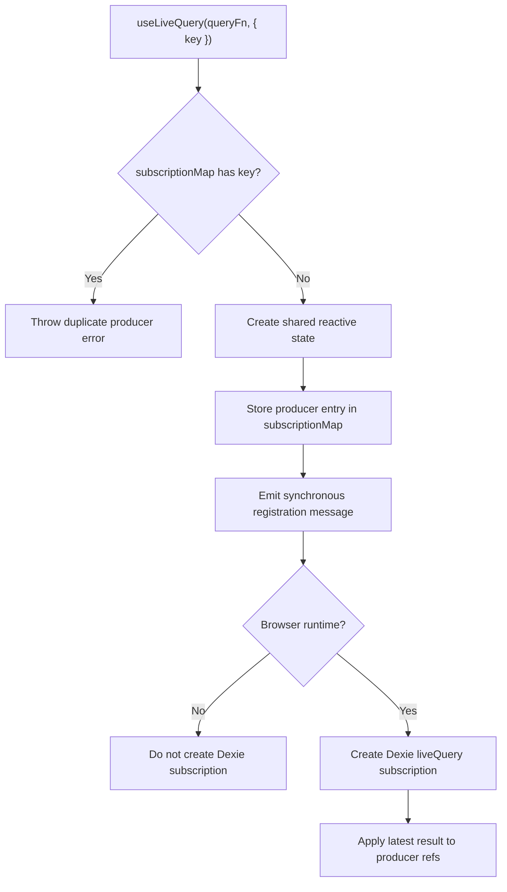
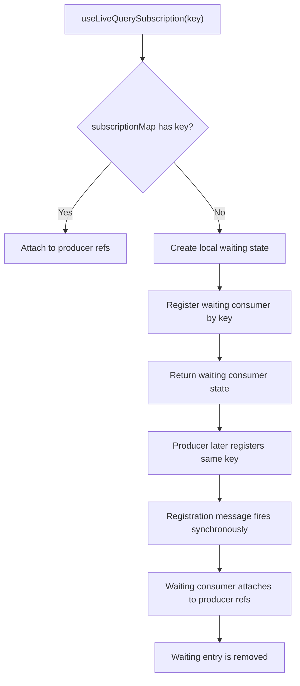
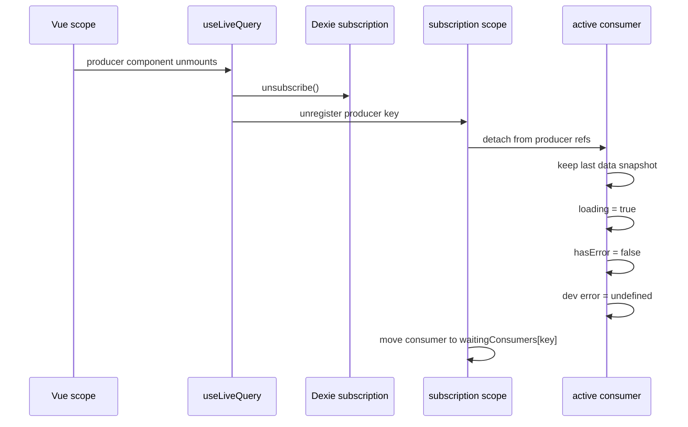
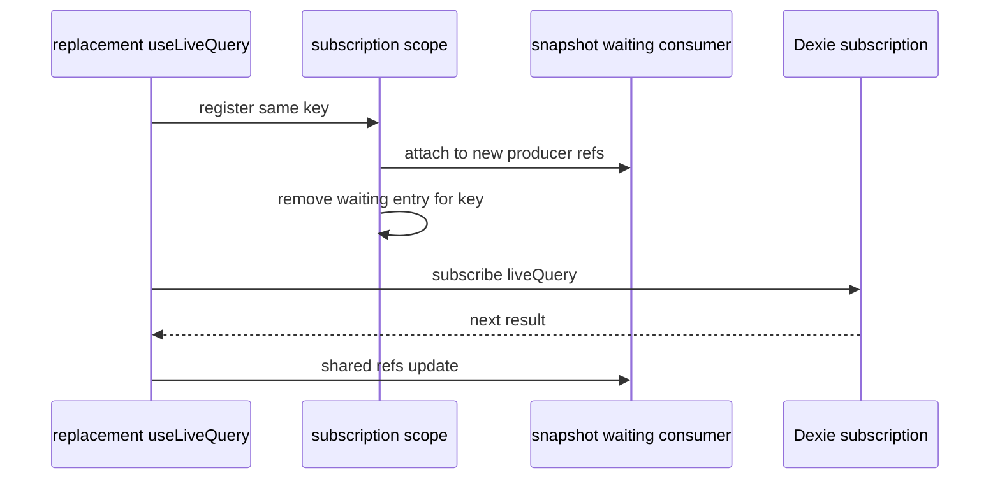
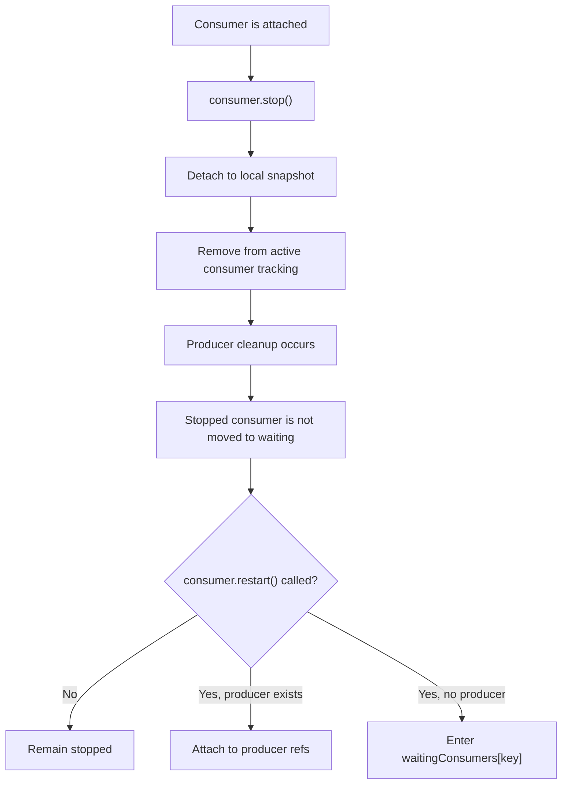

# Live Query Lifecycle

This document explains the producer and consumer lifecycle used by
`dexie-reactive`.

It follows
[ADR 0001: Consumer Lifecycle After Producer Cleanup](./adr/0001-consumer-lifecycle-after-producer-cleanup.md).
The ADR records the accepted target behavior. Runtime implementation of the
consumer re-waiting flow is tracked separately in issue #80.

## Ownership Model

`useLiveQuery(queryFn, options?)` is the producer. It owns the real Dexie
`liveQuery` subscription for a key and is the only API that may call
`liveQuery(() => ...)`, `.subscribe(...)`, and `.unsubscribe()`.

`useLiveQuerySubscription(key)` is the consumer. It receives only a key, never a
query function, and never creates a Dexie subscription. A consumer either waits
for a producer, attaches to an existing producer state, holds a local snapshot,
or is stopped.

The `subscriptionMap` is the source of truth for active producer-owned shared
state. Waiting consumers are coordinated by key until a producer registers. The
accepted re-waiting behavior additionally requires active consumer tracking so
producer cleanup can move attached consumers back to waiting state.

## Consumer States

State meanings:

- `Waiting`: no producer exists for the key; the consumer waits by key.
- `Attached`: the consumer uses the same reactive refs as the producer state.
- `SnapshotWaiting`: the producer was cleaned up, but the mounted consumer keeps
  the last data snapshot while waiting for a replacement producer.
- `Stopped`: the consumer has been manually detached and will not auto-reattach.

## Producer-First Flow

The producer-first path is the simplest path: the producer owns the query and
creates shared state before any consumer asks for it. Later consumers attach by
key and receive the producer refs.

## Consumer-First Waiting Flow

Waiting consumers do not create Dexie subscriptions. They only hold local state
until a producer appears for the same key.

## Producer Cleanup With Mounted Consumer

Producer cleanup means live-query ownership is missing. It does not mean a still
mounted consumer no longer needs the last known data. The consumer keeps its
snapshot while it waits for the same key.

When the consumer scope is disposed, the snapshot is released with the composable
state. If an application stores the returned refs elsewhere, that longer
lifetime belongs to the application.

## Replacement Producer Reattach

Replacement producer registration is synchronous from the consumer perspective:
the consumer attaches to the new shared refs during producer registration and
then receives future Dexie updates through those refs.

## Stopped Consumer Negative Flow

Manual `stop()` is an explicit consumer-level decision. Producer cleanup must not
reactivate a stopped consumer because that would make `stop()` unreliable.

## Controls

Producer controls from `useLiveQuery` affect the real Dexie subscription:

- `stop()` unsubscribes from Dexie, sets `loading` to `false`, and keeps current
  data.
- `restart()` resets state and creates a new Dexie subscription with the latest
  query function.

Consumer controls from `useLiveQuerySubscription` affect only that consumer:

- `stop()` detaches the consumer, keeps a local snapshot, removes it from waiting
  and active tracking, and sets local `loading` to `false`.
- `restart()` tries to attach to the current producer for the same key, or waits
  for that key when no producer exists.

Consumer controls never stop, restart, or create the producer-owned Dexie live
query.

## Implementation Boundary

This document describes the accepted lifecycle behavior. Until the runtime work
from issue #80 is merged, existing consumers may still keep old producer refs
after producer cleanup instead of automatically entering `SnapshotWaiting`.
